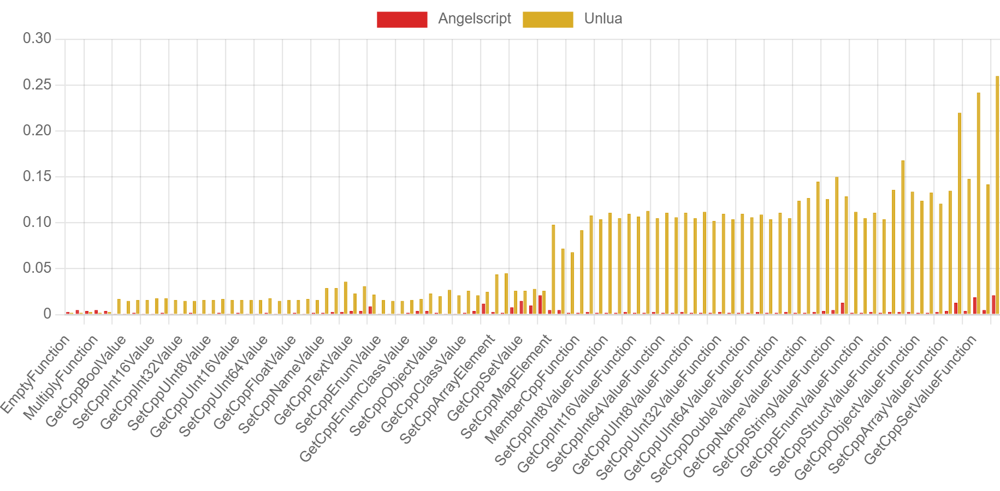
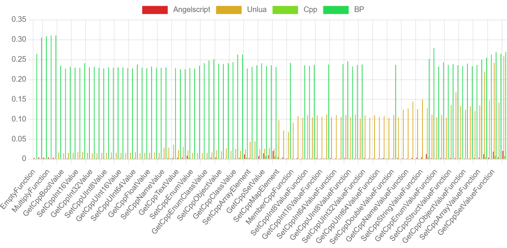
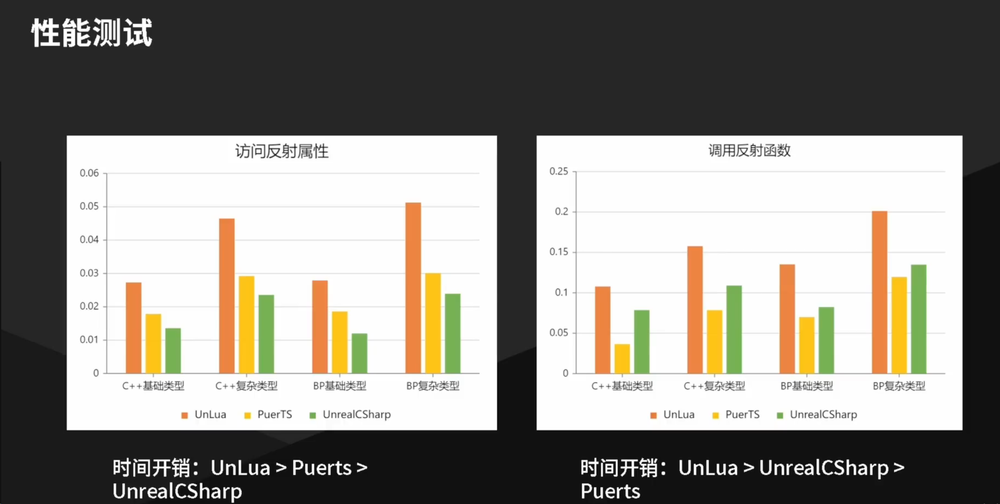

## Unreal Angelscript performance

主要代码来自于 [crazytuzi/ScriptPluginCompare (github.com)](https://github.com/crazytuzi/ScriptPluginCompare).

clone 过程中lfs限流了，没法全部clone，索性只对比了unlua和angelscript

as还没研究怎么调用蓝图，但理论上as应该用不到调用蓝图，as里面fstring的会有比较多的拷贝，性能不好

## Result

- Editor Development
- PIE
- 蓝图有些空的是不支持对应的类型






[[UnrealCircle成都\]UnrealCSharp-UE下C#编程插件 | 皮皮_哔哩哔哩_bilibili](https://www.bilibili.com/video/BV1CC411L7mh/?share_source=copy_web&vd_source=85dc713a4fb92e3a9fc08ad4a7041360)




## Begin Test

```
Open /Game/FirstPerson/Maps/TestMap.TestMap
```

Click button:


Result output: `[ProjectPath]/Saved/xxx.csv`

主要思路：生成一个测试actor，begin paly的时候跑下测试

## Build

- Plase use VisualStudio2022
- UE5.4

### Other

- [CSV to Chart Online - WebUtility.io](https://webutility.io/csv-to-chart-online)